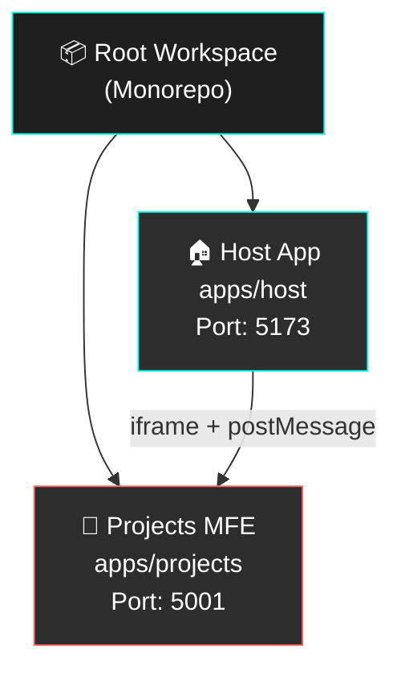
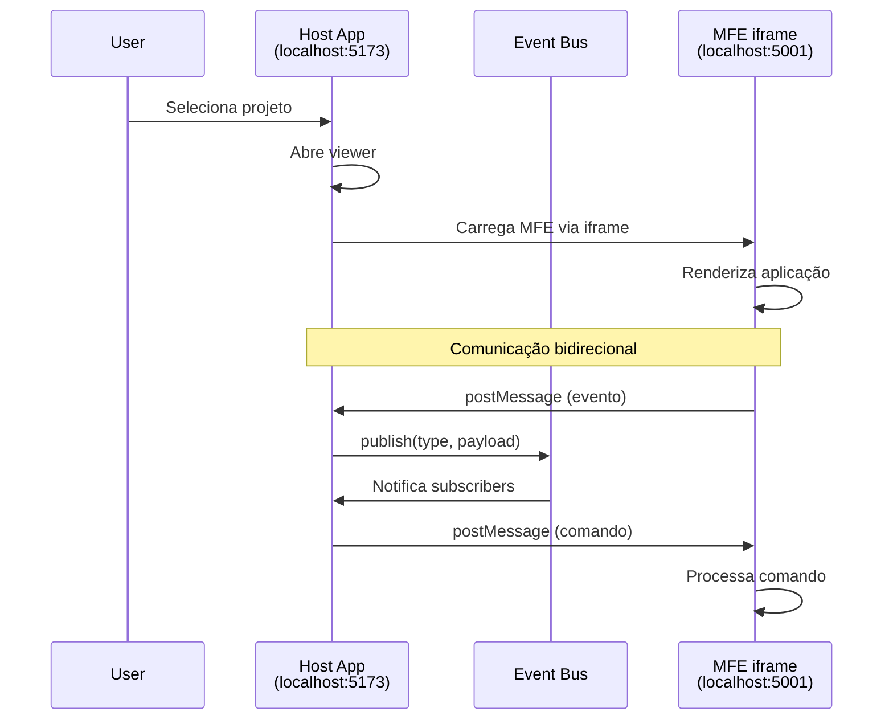
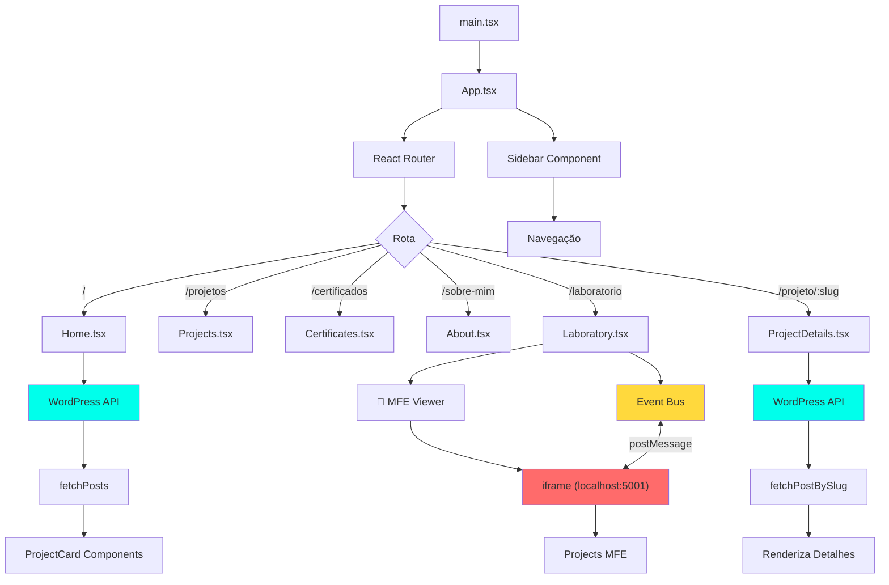
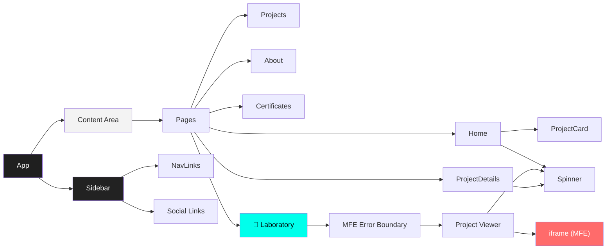

# 🎨 Portfolio Microfrontend

Portfolio moderno e performático com **arquitetura Microfrontend**, construído com React, TypeScript e SASS. Aplicação host consumindo dados do WordPress via REST API e integrando microfrontends isolados via iframe.

## 📋 Sobre o Projeto

Este projeto é um portfólio profissional que demonstra boas práticas de desenvolvimento front-end moderno, incluindo:
- **Arquitetura Microfrontend** com iframe para isolamento completo
- **Monorepo Structure** com workspaces npm (host + microfrontends)
- **Design System** completo com tokens de design (cores, espaçamento, tipografia)
- **Event Bus** para comunicação inter-MFE via postMessage
- **Type-safe** com TypeScript em todos os workspaces
- **Performance otimizada** com lazy loading e code splitting
- **SEO-friendly** com meta tags e estrutura semântica
- **100% Responsivo** com mobile-first approach
- **Isolamento de runtime** com sandbox security

## 🛠️ Stack Tecnológico

### Core
- **React 18** - Biblioteca UI
- **TypeScript** - Type safety
- **Vite** - Build tool rápido
- **React Router** - Navegação SPA
- **npm Workspaces** - Monorepo management
- **Concurrently** - Multi-process orchestration

### Styling
- **SASS/SCSS** - Pre-processador CSS
- **Design System** - Tokens e componentes padronizados
- **CSS Grid/Flexbox** - Layouts responsivos

### API & Data
- **WordPress REST API** (v2)
- **Advanced Custom Fields** (ACF v3)

### Quality & Tooling
- **Vitest** - Framework de testes unitários
- **React Testing Library** - Testes de componentes centrados no usuário
- **Happy-DOM** - Ambiente de simulação de browser leve (substituto do JSDOM)
- **ESLint** - Linting JavaScript/TypeScript
- **Prettier** - Formatação de código
- **Biome** - Lint + Formatter unificado (opcional, focado em performance)
- **Husky** - Git hooks
- **Lint-Staged** - Pre-commit validation

## 📁 Estrutura do Projeto (Monorepo)

```
portfolio-mfe-2025/
├── apps/                      # Workspaces (Microfrontends)
│   ├── host/                 # 🏠 Aplicação Host (Container)
│   │   ├── src/
│   │   │   ├── api/          # Cliente API WordPress
│   │   │   │   └── wp.ts
│   │   │   ├── assets/       # Imagens estáticas
│   │   │   ├── components/   # Componentes do Host
│   │   │   │   ├── ProjectCard.tsx
│   │   │   │   ├── Sidebar.tsx
│   │   │   │   ├── Spinner.tsx
│   │   │   │   └── MFEErrorBoundary.tsx  # Error boundary específico para MFEs
│   │   │   ├── pages/        # Páginas principais
│   │   │   │   ├── Home.tsx
│   │   │   │   ├── Projects.tsx
│   │   │   │   ├── About.tsx
│   │   │   │   ├── Certificates.tsx
│   │   │   │   ├── Laboratory.tsx         # 🔬 Viewer de MFEs com iframe
│   │   │   │   └── ProjectDetails.tsx
│   │   │   ├── utils/        # Utilitários
│   │   │   │   └── eventBus.ts           # 📡 Event Bus (postMessage)
│   │   │   ├── styles/       # Design System (SASS)
│   │   │   │   ├── tokens/   # Design Tokens
│   │   │   │   ├── base/     # Reset e global
│   │   │   │   ├── components/
│   │   │   │   │   ├── _laboratory.scss  # Estilos do iframe viewer
│   │   │   │   │   └── ...
│   │   │   │   └── main.scss
│   │   │   ├── App.tsx
│   │   │   └── main.tsx
│   │   ├── public/
│   │   │   └── certificates/
│   │   ├── package.json      # Dependências do host
│   │   ├── vite.config.ts
│   │   └── tsconfig.json
│   │
│   └── projects/             # 🎯 Microfrontend de Projetos (Remote)
│       ├── src/
│       │   ├── projects/     # Projetos isolados
│       │   │   ├── todo-app/
│       │   │   ├── weather/
│       │   │   └── timer/
│       │   ├── App.tsx       # Router dos MFEs
│       │   └── main.tsx
│       ├── package.json      # Dependências independentes
│       ├── vite.config.ts
│       └── tsconfig.json
│
├── node_modules/             # Dependências raiz
├── package.json              # 📦 Root - Workspace orchestration
├── .env                      # Variáveis de ambiente
├── eslint.config.js          # Config ESLint compartilhada
├── .prettierrc               # Config Prettier compartilhada
└── README.md
```

## 🎨 Design System

### Tokens de Design

#### Cores
```scss
// Principais
$color-brand: #00ffeb;
$color-dark: #1f1f1f;
$color-light: #f3f3f3;

// Escala de cinzas (50-900)
$color-gray-100, $color-gray-200, ..., $color-gray-900
```

#### Espaçamento (múltiplos de 4px)
```scss
$space-0: 0;      // 0px
$space-1: 4px;    // 4px
$space-2: 8px;    // 8px
$space-3: 12px;   // 12px
$space-4: 16px;   // 16px
$space-6: 24px;   // 24px
$space-8: 32px;   // 32px
$space-10: 40px;  // 40px
$space-16: 64px;  // 64px
```

#### Tipografia
```scss
// Tamanhos
$font-size-xs: 0.625rem;  // 10px
$font-size-sm: 0.75rem;   // 12px
$font-size-base: 1rem;    // 16px
$font-size-xl: 1.5rem;    // 24px

// Weights
$font-weight-medium: 500;
$font-weight-bold: 700;
$font-weight-black: 900;
```

## 🏗️ Arquitetura Microfrontend

### 🎯 Visão Geral

Este projeto utiliza **arquitetura Microfrontend com iframe** para isolar completamente diferentes aplicações. A abordagem com iframe oferece:

- ✅ **Isolamento completo** de runtime e estilos
- ✅ **Independência de versões** (cada MFE pode ter suas próprias dependências)
- ✅ **Deploy independente** de cada microfrontend
- ✅ **Segurança** via sandbox attributes
- ✅ **Fallback confiável** em caso de falhas individuais

### 📐 Estrutura de Workspaces



### 🔄 Comunicação entre MFEs

A comunicação entre o Host e os Microfrontends é feita via **postMessage API** + **Event Bus**:



### 🛡️ Segurança com Sandbox

O iframe utiliza atributos `sandbox` para controlar permissões:

```html
<iframe
  src="http://localhost:5001/todo-app"
  sandbox="allow-scripts allow-same-origin allow-forms allow-popups"
/>
```

**Permissões habilitadas:**
- `allow-scripts` - Execução de JavaScript
- `allow-same-origin` - Comunicação via postMessage
- `allow-forms` - Submissão de formulários
- `allow-popups` - Abertura de popups (quando necessário)

### 🎨 Padrões de Design

1. **Microfrontend Architecture**
   - Host (container) + Remotes (microfrontends)
   - Isolamento via iframe
   - Comunicação via Event Bus (postMessage)
   - Error boundaries específicos para MFEs

2. **Monorepo com Workspaces**
   - npm workspaces para gerenciar múltiplos apps
   - Dependências compartilhadas na raiz
   - Configurações unificadas (ESLint, Prettier)

3. **Component-Based Architecture**
   - Componentes pequenos e reutilizáveis
   - Separação de responsabilidades (apresentação vs lógica)
   - Props typing com TypeScript

4. **Atomic Design System** (Host)
   - Tokens (cores, espaçamento, tipografia)
   - Componentes (sidebar, card, button)
   - Layouts (grid system, estrutura principal)

5. **API Integration Pattern** (Host)
   - Cliente centralizado (`apps/host/src/api/wp.ts`)
   - Type-safe com interfaces TypeScript
   - Error handling consistente

6. **SASS Organization** (ITCSS-inspired)
   - **Tokens** → Design tokens (variáveis)
   - **Base** → Reset e estilos globais
   - **Utilities** → Mixins e funções
   - **Layouts** → Sistema de grid
   - **Components** → Componentes isolados

### 🧩 Fluxo de Dados (Host App)



### 🧱 Arquitetura de Componentes



## 🚀 Como Usar

### 1. Configuração Inicial

```bash
# Clone o repositório
git clone <repo-url>
cd portfolio-mfe-2025

# Instale as dependências de todos os workspaces
npm install

# Configure variáveis de ambiente
cp .env.example .env
# Edite .env com suas URLs do WordPress
```

### 2. Desenvolvimento (Monorepo)

```bash
# Inicia TODOS os microfrontends simultaneamente
npm run dev
# Isso roda:
# - Host App em http://localhost:5173
# - Projects MFE em http://localhost:5001

# OU rode individualmente:

# Apenas o Host
npm run dev:host

# Apenas o MFE de Projects
npm run dev:projects
```

**Portas configuradas:**
- **Host**: `5173` (aplicação principal)
- **Projects MFE**: `5001` (microfrontend de projetos)

### 3. Build & Deploy

```bash
# Gera build de TODOS os workspaces
npm run build

# OU build individual:
npm run build:host      # Build apenas do host
npm run build:projects  # Build apenas do Projects MFE

# Preview dos builds
npm run preview         # Preview de todos
npm run preview:host    # Preview apenas do host
npm run preview:projects # Preview apenas do MFE

# Deploy:
# 1. Faça upload de apps/host/dist/ para o servidor principal
# 2. Faça upload de apps/projects/dist/ para um subdomínio ou path separado
# 3. Atualize as URLs no código para apontar para produção
```

### 4. Linting & Formatação

```bash
# Verifica problemas de lint (ESLint)
npm run lint

# Auto-corrige problemas (ESLint)
npm run lint:fix

# Formata código (Prettier)
npm run format

# Executa lint + format de uma vez (ESLint + Prettier)
npm run clean

# Lint e format com Biome (opcional)

# Checa todos os apps com Biome (regras recomendadas)
npm run biome:check

# Formata código dos apps usando o formatter do Biome
npm run biome:format

# Comando de verificação para CI/CD (equivalente ao biome:check sem warnings suavizados)
npm run biome:ci
```

## 📝 Scripts Disponíveis

### Scripts Raiz (Monorepo)

| Script | Descrição |
|--------|-----------|
| `npm run dev` | Inicia TODOS os microfrontends (host + projects) |
| `npm run dev:host` | Inicia apenas o Host (porta 5173) |
| `npm run dev:projects` | Inicia apenas o Projects MFE (porta 5001) |
| `npm run build` | Build de todos os workspaces |
| `npm run build:host` | Build apenas do Host |
| `npm run build:projects` | Build apenas do Projects MFE |
| `npm run preview` | Preview de todos os builds |
| `npm run preview:host` | Preview do build do Host |
| `npm run preview:projects` | Preview do build do Projects MFE |
| `npm run lint` | Verifica problemas em todos os workspaces |
| `npm run lint:fix` | Corrige problemas automaticamente |
| `npm run format` | Formata código com Prettier |
| `npm run clean` | Lint + Format |
| `npm run biome:check` | Verifica código dos apps com Biome (lint + sugestões de estilo) |
| `npm run biome:format` | Formata código dos apps usando o formatter do Biome |
| `npm run biome:ci` | Checagem de Biome para pipelines de CI/CD |
| `npm run test` | Executa testes unitários (Vitest) |
| `npm run test:ui` | Abre interface gráfica de testes |

### Scripts por Workspace

Você também pode executar comandos em workspaces específicos:

```bash
# Executar comando no workspace do host
npm run dev --workspace=apps/host

# Executar comando no workspace de projects
npm run lint --workspace=apps/projects
```

## 🌐 Configuração de Microfrontends

### Comunicação Host ↔ MFE

**Event Bus (postMessage):**

```typescript
// No Host (apps/host/src/utils/eventBus.ts)
import { eventBus, MFEEvents } from './utils/eventBus'

// Publicar evento
eventBus.publish(MFEEvents.PROJECT_LOADED, { projectId: 'todo-app' })

// Subscrever a evento
eventBus.subscribe(MFEEvents.PROJECT_LOADED, (payload) => {
  console.log('Projeto carregado:', payload)
})
```

**PostMessage do MFE para Host:**

```typescript
// No MFE (apps/projects/src/...)
window.parent.postMessage(
  {
    type: 'PROJECT_READY',
    payload: { name: 'Todo App' }
  },
  'http://localhost:5173' // Origin do Host
)
```

### Adicionar Novo Microfrontend

1. **Criar novo workspace:**

```bash
mkdir -p apps/novo-mfe
cd apps/novo-mfe
npm init -y
```

2. **Adicionar ao package.json raiz:**

```json
{
  "workspaces": [
    "apps/host",
    "apps/projects",
    "apps/novo-mfe"  // Adicionar aqui
  ]
}
```

3. **Adicionar scripts de dev/build:**

```json
"scripts": {
  "dev:novo-mfe": "npm run dev --workspace=apps/novo-mfe",
  "build:novo-mfe": "npm run build --workspace=apps/novo-mfe"
}
```

4. **Configurar porta no Vite:**

```typescript
// apps/novo-mfe/vite.config.ts
export default defineConfig({
  server: {
    port: 5002, // Porta única
    strictPort: true
  }
})
```

### Variáveis de Ambiente (apps/host/.env)

```env
# WordPress API (usado apenas quando mock está desabilitado)
VITE_WP_API_BASE=https://your-wordpress-site.com/wp-json/wp/v2

# Mock data (defina como 'true' para evitar problemas de CORS no desenvolvimento)
VITE_USE_MOCK_DATA=true
```

> **💡 Dica**: Use dados mockados durante o desenvolvimento para evitar problemas de CORS. Defina `VITE_USE_MOCK_DATA=false` apenas quando estiver pronto para conectar à API WordPress real.

### 🎭 Sistema de Mock

O projeto inclui um sistema simples de mock para evitar problemas de CORS durante o desenvolvimento local.

**Arquivos:**
- `apps/host/src/api/mockData.ts` - Dados de exemplo para projetos
- `apps/host/src/api/wp.ts` - Cliente API com suporte a mock
- `apps/host/MOCK_SYSTEM.md` - Documentação detalhada
- `ENV_CLEANUP.md` - Guia de limpeza de variáveis de ambiente

**Como usar:**

1. **Habilitar modo mock** (edite `apps/host/.env`):
   ```env
   VITE_USE_MOCK_DATA=true
   ```

2. **Reiniciar servidor de desenvolvimento**:
   ```bash
   npm run dev
   ```

3. **Verificar no console** - Você verá:
   ```
   🎭 Using mock data for projects
   ```

**Personalizando dados mockados:**

Edite `apps/host/src/api/mockData.ts` para adicionar, remover ou modificar projetos mockados:

```typescript
export const mockProjects: WPPost[] = [
  {
    id: 7,
    slug: 'meu-novo-projeto',
    acf: {
      title_post: 'Meu Novo Projeto',
      // ... resto dos dados
    }
  }
]
```

**Variáveis ativas:**
- ✅ `VITE_WP_API_BASE` - URL da API WordPress (apenas quando `USE_MOCK_DATA=false`)
- ✅ `VITE_USE_MOCK_DATA` - Alterna modo mock (padrão: `false`)

### Campos ACF Esperados

```typescript
interface WPPost {
  id: number;
  slug: string;
  title: { rendered: string };
  content: { rendered: string };
  acf: {
    title_post?: string;
    image_post?: {
      url: string;
      sizes?: {
        medium?: string;
        large?: string;
      };
    };
    list_of_technologies?: TechnologyTag[];
  };
}
```

## 🎯 Features

### Arquitetura
- ✅ **Microfrontend com iframe** para isolamento completo
- ✅ **Monorepo** com npm workspaces
- ✅ **Event Bus** para comunicação inter-MFE
- ✅ **MFE Error Boundaries** específicos
- ✅ **Sandbox Security** nos iframes

### Design & UX
- ✅ Design System completo com SASS
- ✅ TypeScript com type-safety total
- ✅ Lazy loading de imagens
- ✅ Animações suaves
- ✅ 100% Responsivo
- ✅ SEO otimizado

### Integrações
- ✅ Integração com WordPress API
- ✅ Advanced Custom Fields (ACF)

### Quality & Tooling
- ✅ Performance otimizada
- ✅ Git hooks (Husky + Lint-Staged)
- ✅ ESLint + Prettier configurados
- ✅ Build otimizado com Vite

## 📱 Responsividade

Breakpoints definidos:
- **sm**: 640px
- **md**: 768px
- **lg**: 960px
- **xl**: 1280px
- **2xl**: 1536px

## 🧪 Testes Automatizados

O projeto conta com uma suíte de testes unitários robusta utilizando **Vitest** e **React Testing Library**.

### Stack de Testes
- **Vitest**: Test Runner rápido e compatível com Vite.
- **Happy-DOM**: Ambiente DOM simulado para execução rápida.
- **React Testing Library**: Testes de interação focados no usuário.

### Cobertura
Os testes cobrem os principais aspectos da aplicação `host`:

1. **Componentes Core**:
   - `Card`, `ProjectCard`, `Spinner`, `Sidebar`, `MFEErrorBoundary`.
   - Validação de renderização, variantes, interatividade e error handling.

2. **Páginas**:
   - `Home`, `About`, `Projects`.
   - Mocks de APIs externas (GitHub, WordPress) para testes isolados.
   - Validação de estados de loading e exibição de dados.

### Executando Testes

```bash
# Rodar todos os testes (watch mode padrão)
npm run test

# Rodar testes apenas uma vez (CI/CD)
npm run test -- --run

# Rodar testes com interface gráfica
npm run test:ui
```
