```mermaid
graph TB
    ROOT["📦 Root Workspace<br/>(Monorepo)"] --> HOST["🏠 Host App<br/>apps/host<br/>Port: 5173"]
    ROOT --> PROJECTS["🎯 Projects MFE<br/>apps/projects<br/>Port: 5001"]
    
    HOST --> |"iframe + postMessage"| PROJECTS
    
    style ROOT fill:#1f1f1f,stroke:#00ffeb,color:#fff
    style HOST fill:#2d2d2d,stroke:#00ffeb,color:#fff
    style PROJECTS fill:#2d2d2d,stroke:#ff6b6b,color:#fff
```

```mermaid
flowchart LR
    A[App] --> B[Sidebar]
    A --> C[Content Area]
    
    C --> D[Pages]
    D --> E[Home]
    D --> F[Projects]
    D --> G[About]
    D --> H[Certificates]
    D --> I["🔬 Laboratory"]
    D --> J[ProjectDetails]
    
    E --> K[ProjectCard]
    E --> L[Spinner]
    
    I --> M["MFE Error Boundary"]
    M --> N["Project Viewer"]
    N --> O["iframe (MFE)"]
    N --> L
    
    J --> L
    
    B --> P[NavLinks]
    B --> Q[Social Links]
    
    style A fill:#1f1f1f,color:#fff
    style B fill:#222,color:#fff
    style C fill:#f3f3f3
    style I fill:#00ffeb,color:#000
    style O fill:#ff6b6b,color:#fff
```

# 🎨 Portfolio Microfrontend

Modern and high-performance portfolio with **Microfrontend architecture**, built with React, TypeScript, and SASS. Host application consuming WordPress data via REST API and integrating isolated microfrontends via iframe.

## 📋 About the Project

This project is a professional portfolio demonstrating modern front-end development best practices, including:
- **Microfrontend Architecture** with iframe for complete isolation
- **Monorepo Structure** with npm workspaces (host + microfrontends)
- **Design System** complete with design tokens (colors, spacing, typography)
- **Event Bus** for inter-MFE communication via postMessage
- **Type-safe** with TypeScript across all workspaces
- **Optimized Performance** with lazy loading and code splitting
- **SEO-friendly** with meta tags and semantic structure
- **100% Responsive** with mobile-first approach
- **Runtime Isolation** with sandbox security
- **Animated SVG Favicon** with brand color synchronization
- **PWA Ready** with manifest and mobile theme-color customization

## 🛠️ Tech Stack

### Core
- **React 18** - UI Library
- **TypeScript** - Type safety
- **Vite** - Fast build tool
- **React Router** - SPA Navigation
- **npm Workspaces** - Monorepo management
- **Concurrently** - Multi-process orchestration

### Styling
- **SASS/SCSS** - CSS Pre-processor
- **Design System** - Standardized tokens and components
- **CSS Grid/Flexbox** - Responsive layouts

### API & Data
- **WordPress REST API** (v2)
- **Advanced Custom Fields** (ACF v3)

### Quality & Tooling
- **Vitest** - Unit testing framework
- **React Testing Library** - User-centric component tests
- **Happy-DOM** - Lightweight browser simulation environment
- **ESLint** - JavaScript/TypeScript linting
- **Prettier** - Code formatting
- **Biome** - Unified Lint + Formatter (performance-focused)
- **Husky** - Git hooks
- **Lint-Staged** - Pre-commit validation

## 📁 Project Structure (Monorepo)

```
portfolio-mfe-2025/
├── apps/                      # Workspaces (Microfrontends)
│   ├── host/                 # 🏠 Host Application (Container)
│   │   ├── src/
│   │   │   ├── api/          # WordPress API Client
│   │   │   │   └── wp.ts
│   │   │   ├── assets/       # Static assets
│   │   │   ├── components/   # Host Components
│   │   │   │   ├── ProjectCard.tsx
│   │   │   │   ├── Sidebar.tsx
│   │   │   │   ├── Spinner.tsx
│   │   │   │   └── MFEErrorBoundary.tsx  # Specific error boundary for MFEs
│   │   │   ├── pages/        # Main pages
│   │   │   │   ├── Home.tsx
│   │   │   │   ├── Projects.tsx
│   │   │   │   ├── About.tsx
│   │   │   │   ├── Certificates.tsx
│   │   │   │   ├── Laboratory.tsx         # 🔬 MFE Viewer with iframe
│   │   │   │   └── ProjectDetails.tsx
│   │   │   ├── utils/        # Utilities
│   │   │   │   └── eventBus.ts           # 📡 Event Bus (postMessage)
│   │   │   ├── styles/       # Design System (SASS)
│   │   │   │   ├── tokens/   # Design Tokens
│   │   │   │   ├── base/     # Reset and global
│   │   │   │   ├── components/
│   │   │   │   │   ├── _laboratory.scss  # Iframe viewer styles
│   │   │   │   │   └── ...
│   │   │   │   └── main.scss
│   │   │   ├── App.tsx
│   │   │   └── main.tsx
│   │   ├── public/
│   │   │   └── certificates/
│   │   ├── package.json      # Host dependencies
│   │   ├── vite.config.ts
│   │   └── tsconfig.json
│   │
│   └── projects/             # 🎯 Projects Microfrontend (Remote)
│       ├── src/
│       │   ├── projects/     # Isolated projects
│       │   │   ├── todo-app/
│       │   │   ├── weather/
│       │   │   └── timer/
│       │   ├── App.tsx       # MFE Router
│       │   └── main.tsx
│       ├── package.json      # Independent dependencies
│       ├── vite.config.ts
│       └── tsconfig.json
│
├── node_modules/             # Root dependencies
├── package.json              # 📦 Root - Workspace orchestration
├── .env                      # Environment variables
├── eslint.config.js          # Shared ESLint config
├── .prettierrc               # Shared Prettier config
└── README.md
```

## 🎨 Design System

### Design Tokens

#### Colors
```scss
// Main
$color-brand: #00ffeb;
$color-dark: #1f1f1f;
$color-light: #f3f3f3;

// Grayscale (50-900)
$color-gray-100, $color-gray-200, ..., $color-gray-900
```

#### Spacing (Multiples of 4px)
```scss
$space-0: 0;      // 0px
$space-1: 4px;    // 4px
$space-2: 8px;    // 8px
$space-3: 12px;   // 12px
$space-4: 16px;   // 16px
$space-6: 24px;   // 24px
$space-8: 32px;   // 32px
$space-10: 40px;  // 40px
$space-16: 64px;  // 64px
```

#### Typography
```scss
// Sizes
$font-size-body-sm: 0.875rem; // 14px
$font-size-base: 1rem;        // 16px
$font-size-lg: 1.25rem;       // 20px
$font-size-xl: 1.5rem;        // 24px
$font-size-2xl: 2rem;         // 32px
$font-size-3xl: 2.5rem;       // 40px
$font-size-4xl: 3rem;         // 48px
$font-size-display: 4rem;     // 64px

// Weights
$font-weight-regular: 400;
$font-weight-medium: 500;
$font-weight-semibold: 600;
$font-weight-bold: 700;
$font-weight-extrabold: 800;
```

## 🏗️ Microfrontend Architecture

### 🎯 Overview

This project uses **Microfrontend architecture with iframes** to completely isolate different applications. The iframe approach offers:

- ✅ **Complete Isolation** of runtime and styles
- ✅ **Version Independence** (each MFE can have its own dependencies)
- ✅ **Independent Deploy** for each microfrontend
- ✅ **Security** via sandbox attributes
- ✅ **Reliable Fallback** in case of individual failures

> [!NOTE]
> **Architectural Roadmap**: The current **iframe-based isolation** is a strategic temporary choice for immediate runtime and style isolation. The project roadmap includes migrating to a **pure Module Federation** implementation to further enhance performance and deep component integration.

### 📐 Workspace Structure



### 🔄 Communication between MFEs

Communication between the Host and Microfrontends is handled via **postMessage API** + **Event Bus**:


### 🛡️ Sandbox Security

The iframe uses `sandbox` attributes to control permissions:

```html
<iframe
  src="http://localhost:5001/todo-app"
  sandbox="allow-scripts allow-same-origin allow-forms allow-popups"
/>
```

**Enabled Permissions:**
- `allow-scripts` - JavaScript execution
- `allow-same-origin` - Communication via postMessage
- `allow-forms` - Form submission
- `allow-popups` - Opening popups (when necessary)

### 🎨 Design Patterns

1. **Microfrontend Architecture**
   - Host (container) + Remotes (microfrontends)
   - Isolation via iframe
   - Communication via Event Bus (postMessage)
   - Specific error boundaries for MFEs

2. **Monorepo with Workspaces**
   - npm workspaces to manage multiple apps
   - Shared dependencies at root
   - Unified configurations (ESLint, Prettier)

3. **Component-Based Architecture**
   - Small, reusable components
   - Separation of concerns (presentation vs logic)
   - Props typing with TypeScript

4. **Atomic Design System** (Host)
   - Tokens (colors, spacing, typography)
   - Components (sidebar, card, button)
   - Layouts (grid system, main structure)

5. **API Integration Pattern** (Host)
   - Centralized client (`apps/host/src/api/wp.ts`)
   - Type-safe with TypeScript interfaces
   - Consistent error handling

6. **SASS Organization** (ITCSS-inspired)
   - **Tokens** → Design tokens (variables)
   - **Base** → Reset and global styles
   - **Utilities** → Mixins and functions
   - **Layouts** → Grid system
   - **Components** → Isolated components

### 🧩 Data Flow (Host App)

```mermaid
flowchart TD
    A[main.tsx] --> B[App.tsx]
    B --> C[React Router]
    C --> D{Route}
    
    D -->|/| E[Home.tsx]
    D -->|/projetos| F[Projects.tsx]
    D -->|/certificados| G[Certificates.tsx]
    D -->|/sobre-mim| H[About.tsx]
    D -->|/laboratorio| I[Laboratory.tsx]
    D -->|/projeto/:slug| J[ProjectDetails.tsx]
    
    E --> K[WordPress API]
    K --> L[fetchPosts]
    L --> M[ProjectCard Components]
    
    J --> N[WordPress API]
    N --> O[fetchPostBySlug]
    O --> P[Render Details]
    
    I --> Q["🔬 MFE Viewer"]
    Q --> R["iframe (localhost:5001)"]
    R --> S[Projects MFE]
    
    B --> T[Sidebar Component]
    T --> U[Navigation]
    
    I --> V[Event Bus]
    V <--> |postMessage| R
    
    style K fill:#00ffeb
    style N fill:#00ffeb
    style R fill:#ff6b6b
    style V fill:#ffd93d
```



### 🧱 Component Architecture



## 🚀 Getting Started

### 1. Initial Setup

```bash
# Clone the repository
git clone <repo-url>
cd portfolio-mfe-2025

# Install dependencies for all workspaces
npm install

# Configure environment variables
cp .env.example .env
# Edit .env with your WordPress URLs
```

### 2. Development (Monorepo)

```bash
# Start ALL microfrontends simultaneously
npm run dev
# This runs:
# - Host App at http://localhost:5173
# - Projects MFE at http://localhost:5001

# OR run individually:

# Host only
npm run dev:host

# Projects MFE only
npm run dev:projects
```

**Configured Ports:**
- **Host**: `5173` (main application)
- **Projects MFE**: `5001` (projects microfrontend)

### 3. Build & Deploy

```bash
# Generate build for ALL workspaces
npm run build

# OR individual build:
npm run build:host      # Build host only
npm run build:projects  # Build Projects MFE only

# Preview builds
npm run preview         # Preview all
npm run preview:host    # Preview host only
npm run preview:projects # Preview MFE only

# Deploy:
# 1. Upload apps/host/dist/ to your main server
# 2. Upload apps/projects/dist/ to a separate subdomain or path
# 3. Update URLs in code to point to production
```

### 4. Linting & Formatting

```bash
# Check for lint issues (ESLint)
npm run lint

# Auto-fix issues (ESLint)
npm run lint:fix

# Format code (Prettier)
npm run format

# Run lint + format at once (ESLint + Prettier)
npm run clean

# Lint and format with Biome (optional)

# Check all apps with Biome (recommended rules)
npm run biome:check

# Format code using Biome formatter
npm run biome:format

# CI/CD verification command
npm run biome:ci
```

## 📝 Available Scripts

### Root Scripts (Monorepo)

| Script | Description |
|--------|-------------|
| `npm run dev` | Inicia TODOS os microfrontends (host + projects) |
| `npm run dev:host` | Inicia apenas o Host (porta 5173) |
| `npm run dev:projects` | Inicia apenas o Projects MFE (porta 5001) |
| `npm run build` | Build de todos os workspaces |
| `npm run build:host` | Build apenas do Host |
| `npm run build:projects` | Build apenas do Projects MFE |
| `npm run preview` | Preview de todos os builds |
| `npm run preview:host` | Preview do build do Host |
| `npm run preview:projects` | Preview do build do Projects MFE |
| `npm run lint` | Verifica problemas em todos os workspaces |
| `npm run lint:fix` | Corrige problemas automaticamente |
| `npm run format` | Formata código com Prettier |
| `npm run clean` | Lint + Format |
| `npm run biome:check` | Verifica código dos apps com Biome (lint + sugestões de estilo) |
| `npm run biome:format` | Formata código dos apps usando o formatter do Biome |
| `npm run biome:ci` | Checagem de Biome para pipelines de CI/CD |
| `npm run test` | Executa testes unitários (Vitest) |
| `npm run test:ui` | Abre interface gráfica de testes |

### Workspace Scripts

You can also run commands in specific workspaces:

```bash
# Run command in host workspace
npm run dev --workspace=apps/host

# Run command in projects workspace
npm run lint --workspace=apps/projects
```

## 🌐 Microfrontends Configuration

### Host ↔ MFE Communication

**Event Bus (postMessage):**

```typescript
// In Host (apps/host/src/utils/eventBus.ts)
import { eventBus, MFEEvents } from './utils/eventBus'

// Publish event
eventBus.publish(MFEEvents.PROJECT_LOADED, { projectId: 'todo-app' })

// Subscribe to event
eventBus.subscribe(MFEEvents.PROJECT_LOADED, (payload) => {
  console.log('Project loaded:', payload)
})
```

**PostMessage from MFE to Host:**

```typescript
// In MFE (apps/projects/src/...)
window.parent.postMessage(
  {
    type: 'PROJECT_READY',
    payload: { name: 'Todo App' }
  },
  'http://localhost:5173' // Host Origin
)
```

### Adding a New Microfrontend

1. **Create new workspace:**

```bash
mkdir -p apps/new-mfe
cd apps/new-mfe
npm init -y
```

2. **Add to root package.json:**

```json
{
  "workspaces": [
    "apps/host",
    "apps/projects",
    "apps/new-mfe"  // Add here
  ]
}
```

3. **Add dev/build scripts:**

```json
"scripts": {
  "dev:new-mfe": "npm run dev --workspace=apps/new-mfe",
  "build:new-mfe": "npm run build --workspace=apps/new-mfe"
}
```

4. **Configure port in Vite:**

```typescript
// apps/new-mfe/vite.config.ts
export default defineConfig({
  server: {
    port: 5002, // Unique port
    strictPort: true
  }
})
```

### Environment Variables (apps/host/.env)

```env
# WordPress API (used only when mock is disabled)
VITE_WP_API_BASE=https://your-wordpress-site.com/wp-json/wp/v2

# Microfrontends Base URL (Default: localhost:5001)
# In production, point to the URL where projects are hosted
VITE_PROJECTS_URL=http://localhost:5001

# Mock data (set to 'true' to avoid CORS issues during development)
VITE_USE_MOCK_DATA=true
```

> **💡 Tip**: Use mocked data during development to avoid CORS issues. Set `VITE_USE_MOCK_DATA=false` only when ready to connect to the real WordPress API.

### 🎭 Mock System

The project includes a simple mock system to avoid CORS issues during local development.

**Files:**
- `apps/host/src/api/mockData.ts` - Example project data
- `apps/host/src/api/wp.ts` - API client with mock support
- `apps/host/MOCK_SYSTEM.md` - Detailed documentation
- `ENV_CLEANUP.md` - Environment variable cleanup guide

**How to use:**

1. **Enable mock mode** (edit `apps/host/.env`):
   ```env
   VITE_USE_MOCK_DATA=true
   ```

2. **Restart development server**:
   ```bash
   npm run dev
   ```

3. **Check console** - You will see:
   ```
   🎭 Using mock data for projects
   ```

**Customizing mocked data:**

Edit `apps/host/src/api/mockData.ts` to add, remove, or modify mocked projects:

```typescript
export const mockProjects: WPPost[] = [
  {
    id: 7,
    slug: 'my-new-project',
    acf: {
      title_post: 'My New Project',
      // ... rest of data
    }
  }
]
```

**Active variables:**
- ✅ `VITE_WP_API_BASE` - WordPress API URL (only when `USE_MOCK_DATA=false`)
- ✅ `VITE_USE_MOCK_DATA` - Toggles mock mode (default: `false`)

### Expected ACF Fields

```typescript
interface WPPost {
  id: number;
  slug: string;
  title: { rendered: string };
  content: { rendered: string };
  acf: {
    title_post?: string;
    image_post?: {
      url: string;
      sizes?: {
        medium?: string;
        large?: string;
      };
    };
    list_of_technologies?: TechnologyTag[];
  };
}
```

## 🎯 Features

### Architecture
- ✅ **Microfrontend with iframe** for complete isolation (Roadmap: Pure Module Federation)
- ✅ **Monorepo** with npm workspaces
- ✅ **Event Bus** for inter-MFE communication
- ✅ **Specific MFE Error Boundaries**
- ✅ **Sandbox Security** in iframes

### Design & UX
- ✅ Complete Design System with SASS
- ✅ Total Type-safety with TypeScript
- ✅ Image Lazy Loading
- ✅ Smooth Animations (Framer Motion)
- ✅ Cinematic Home Page
- ✅ **Animated SVG Favicon** synchronized with brand colors
- ✅ **PWA Manifest** with custom mobile theme-color
- ✅ 100% Responsive (Mobile & Desktop)
- ✅ Optimized SEO

### Integrations
- ✅ WordPress API Integration
- ✅ Advanced Custom Fields (ACF)
- ✅ Legacy Vue 2 Projects (via Custom URL)

### Quality & Tooling
- ✅ Optimized Performance
- ✅ Git hooks (Husky + Lint-Staged)
- ✅ Pre-configured ESLint + Prettier
- ✅ Optimized build with Vite

## 📱 Responsiveness

### Breakpoints & Mixins

Breakpoints are defined in `_breakpoints.scss`. **Crucial Rule**: Hardcoded pixel values in media queries are forbidden. Always use the provided mixins.

| Breakpoint | Value | Mixin | Use Case |
|------------|-------|-------|----------|
| **sm** | 640px | `@include media-sm` | Mobile |
| **md** | 768px | `@include media-md` | Tablet Portrait |
| **lg-tablet**| 1024px | `@include media-lg-tablet` | Tablet Landscape |
| **lg** | 960px | `@include media-lg` | Small Laptops |
| **xl** | 1280px | `@include media-xl` | Desktop |
| **2xl** | 1536px | `@include media-2xl` | Large Screens |
| **short-v** | 850px (h) | `@include media-short-vertical`| Small Heights |

### Usage Example:
```scss
.my-component {
  width: 100%;
  
  @include media-md-up {
    width: 50%; // Responsive adjustment using standard mixin
  }
}
```

## 🧪 Automated Testing

The project includes a robust suite of unit tests using **Vitest** and **React Testing Library**.

### Testing Stack
- **Vitest**: Fast and Vite-compatible test runner.
- **Happy-DOM**: Simulated DOM environment for fast execution.
- **React Testing Library**: User-centric interaction tests.

### Coverage
Tests cover key aspects of the `host` application:

1. **Core Components**:
   - `Card`, `ProjectCard`, `Spinner`, `Sidebar`, `MFEErrorBoundary`.
   - Validation of rendering, variants, interactivity, and error handling.

2. **Pages**:
   - `Home`, `About`, `Projects`.
   - Mocks for external APIs (GitHub, WordPress).
   - Validation of loading states and data display.

### Running Tests

```bash
# Run all tests (default watch mode)
npm run test

# Run tests once (CI/CD)
npm run test -- --run

# Run tests with graphical interface
npm run test:ui
```
